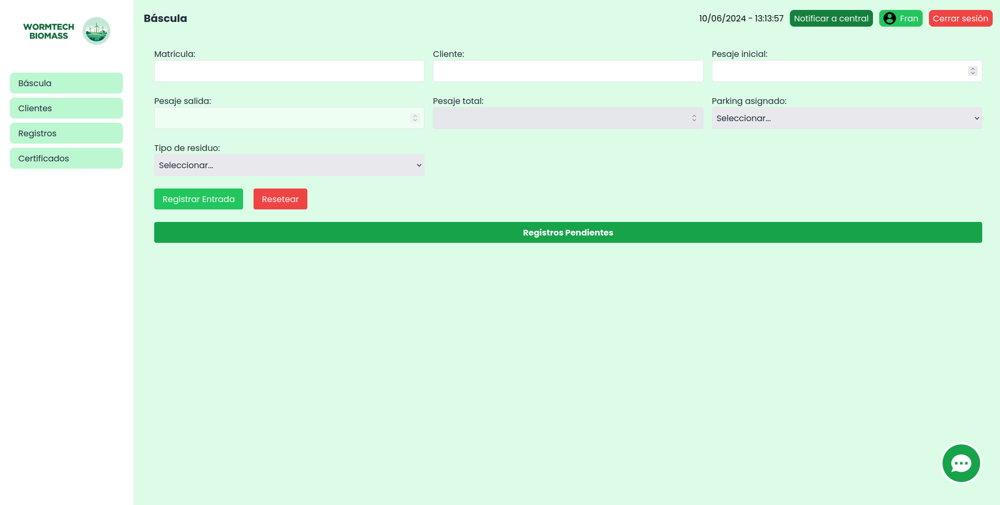
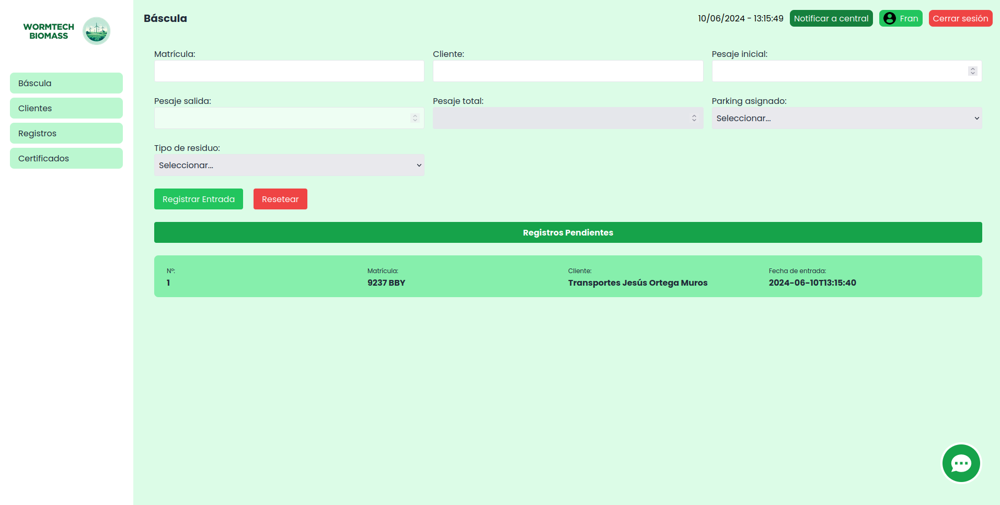
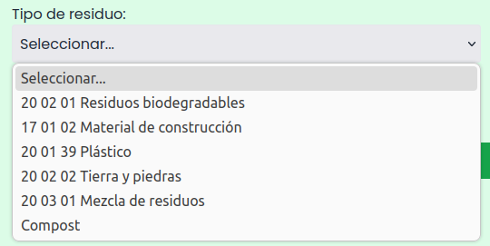
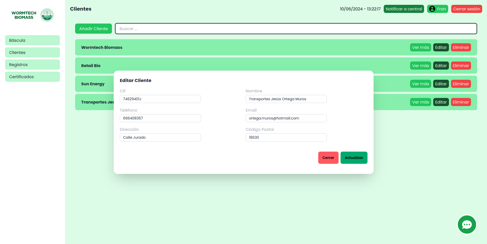
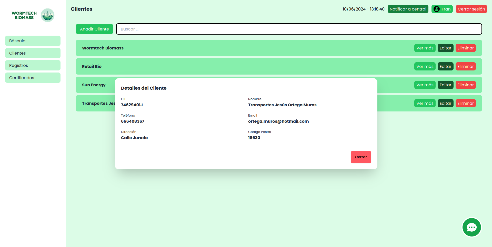
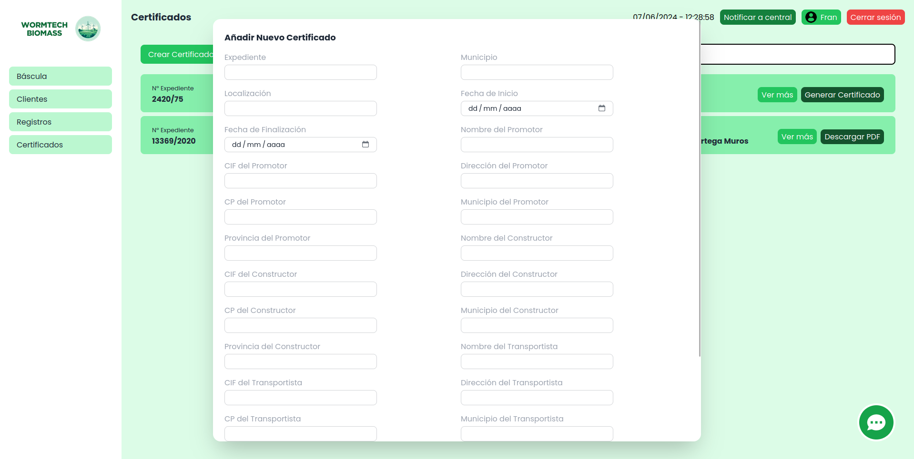

  

<h1 align="center">
React Application Wormtech Biomass - TFG | Fran - Javi - Alex
</h1>

# Empieza con Create React App

Este proyecto fue creado con [Create React App](https://github.com/facebook/create-react-app).

## Acerca de Wormtech Biomass

Wormtech Biomass es el resultado del Trabajo de Fin de Grado para el Grado de Aplicaciones Multiplataforma. Este proyecto tiene como objetivo principal proporcionar una solución eficiente para el control de una planta de reciclaje, permitiendo a los usuarios administrar y monitorear diferentes aspectos de la planta de manera efectiva.

Características Principales:

- Autenticación Segura: La aplicación cuenta con un sistema de login que garantiza la seguridad de los datos y la autenticación de los usuarios.

- Registro de Usuarios: Permite a los usuarios crear cuentas nuevas para acceder a la plataforma y gestionar la planta de reciclaje.

- Dashboard Intuitiva: La interfaz de usuario incluye un dashboard intuitivo que proporciona una visión general de los diferentes aspectos de la planta, como el registro de entrada y salida de clientes, vista de clientes y vista de registros.

- Generación de Facturas: Puedes generar facturas de los registros de forma automatizada.

- Generación de Certificados: Permite generar certificados de obra para los clientes de forma automatizada.

## Scripts Disponibles

En el directorio del proyecto, Puedes ejecutar:

### `npm start`

Inicia la aplicacion.\
Abre [http://localhost:3000](http://localhost:3000) para visualizarlo en tu navegador.

La página se actualizará automaticamente cuando hagas cambios.\
Es posible que también veas cualquier error de lint en la consola.

### `npm install`

Instala las dependencias necesarias para ejecutar la aplicación.

## Screenshots

### Registro:

Página para poder registrarnos en nuestra App

### Iniciar sesión:

Página para hacer el login con nuestra cuenta.

### Báscula:

Página que se nos muestra al iniciar sesión, donde aparecen el panel de control, como página principal el control de báscula, al igual que se nos muestran los botones a la izquierda para poder navegar a otras páginas.

### Registro de entrada:

El operario de bascula llenará los datos pertinentes para poder hacer un registro de entrada. Los datos del pesaje llegán de manera automática.

### Registro pendiente:

Al realizar un registro de entrada este pasará a formar parte de los registros pendientes, para luego más tarde cuando vaya a salir el cliente de las instalaciones realizar el registro de salida.

### Registro de salida:

Al hacer click en el registro pendiente todos los datos se nos rellenarán con los datos que hemos introducido en el registro de entrada, además el pesaje final vendrá dado por la báscula y el pesaje total se calcula de manera automática.

### Sugerencia de cliente:

Se nos muestran las sugerencias de clientes teniendo en cuenta el texto escrito con las opciones disponibles.

### Parking:

Desplegable con las opciones disponibles de Parking.

### Tipo de residuo:

Desplegable con las opciones disponibles de residuos con su código LER.

### Lista de Clientes:

En esta página se nos muestran todos los clientes que hay registrados en nuestra base de datos, donde podemos ver más información detallada de ellos, editarlos, eliminarlos y añadir nuevos clientes. También podemos usar el buscador de la parte superior para buscar un cliente en concreto.

### Añadir cliente:

Pestaña modal que nos permite añadir nuevos clientes rellenando los datos del formulario.

### Editar cliente:

Pestaña modal que nos permite editar clientes.

### Eliminar cliente:

Pestaña de confirmación para borrar un cliente.

### Información del Cliente:

Pestaña modal que muestra información detallada del cliente.

### Lista de Registros:

En esta página se nos muestran todos los registros que hemos realizado, clasificados por fecha y con funcionalidades como poder ver mas detalles del registro y poder generar la factura del mismo. También podemos usar el buscador de la parte superior para buscar un registro en concreto

### Paginación:

Los registros cuentan con una paginación para no sobrecargar la página

### Buscador por filtro:

Permite filtrar por el buscador tanto por mes, cliente, tipo de residuo, año, matricula y por factura/no facturado.

### Detalles del registro:

Pestaña modal que muestra información detallada del registro.

### Generar factura:

Al hacer click en el boton de generar factura se nos generará una factura PDF con los datos del registro, haciendo los cálculos de está de manera automática.

### Certificados:

En esta página se nos muestran todos los certificados que hemos emitido, y con funcionalidades como poder ver mas detalles del certificado y poder generar el PDF del mismo. También podemos usar el buscador de la parte superior para buscar un certificado en concreto.

### Crear Certificados:

Pestaña modal que nos permite crear un nuevo certificado rellenando los datos del formulario.

### Detalles del Certificado:

Al hacer click en "Ver más" se nos abriráesta pestaña modal que nos mostrara información detallada del certificado.

### PDF del Certificado:

Al hacer click en el boton de generar certificado se nos generará un certificado PDF con los datos del certificado, para poder entregarselo al cliente.

### ChatIA:

Integración de un ChatIA al cual puedes hacer preguntas de todo tipo.

## Contacto

Si tienes alguna pregunta o sugerencia sobre Wormtech Biomass, no dudes en ponerte en contacto conmigo a través de <a href="mailto:fvfotura@gmail.com">fvfotura@gmail.com</a>.

¡Gracias por tu interés en Wormtech Biomass!

